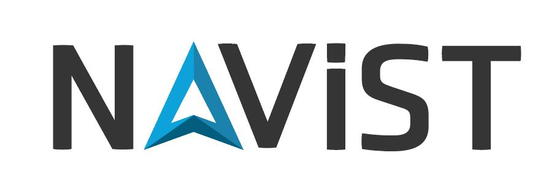
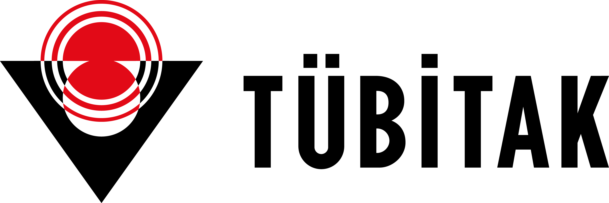
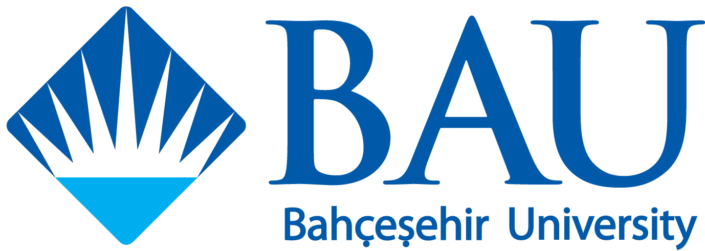

    <a href="#speakers" class="nav-button">Speakers</a>
    <a href="#committee" class="nav-button">Committee</a>
    <a href="#register" class="nav-button">Register</a>
    <a href="#schedule" class="nav-button">Schedule</a>
    <a href="#directions" class="nav-button">Directions</a>
    <a href="#contact" class="nav-button">Contact</a>
    <a href="#sponsors" class="nav-button">Sponsors</a>

Welcome to the "Combinatorics and Geometry in İstanbul" workshop, taking place on August 5 and 6 in the enchanting city of İstanbul. This two-day event is dedicated to bringing together researchers and enthusiasts in the fields of algebra, combinatorics, and geometry, fostering collaboration and the exchange of ideas in a vibrant academic setting.

The mornings will be highlighted by talks from our invited speakers, who will share their latest insights and advancements in their respective fields. In the afternoons, we will host a series of contributed talks, offering participants an opportunity to present their work and spark meaningful discussions.

We are delighted to convene this event in such a unique and inspiring location and look forward to two days of stimulating academic exchange and collaboration.

## Invited Speakers

- Volkmar Welker (Philipps-Universität Marburg)
- Yusuf Civan (Süleyman Demirel University)
- Ayesha Asloob Qureshi (Sabancı University)
- Tolga Birdal (Imperial College London)
- Martina Juhnke (University of Osnabrück)

## Scientific and Organising Committee

- Kağan Kurşungöz (Sabancı University)
- Müge Taşkın (Boğaziçi University)
- Nermine Ahmed El Sissi (Bahçeşehir University)
- Selçuk Kayacan (Bahçeşehir University)

## Registration

Thanks to the generous support of our sponsors, the participation fee for the workshop is only **400 TL**. To register, please follow the steps below.

### 1. Payment Details

Participants must transfer 400 TL to the following bank account:

**Bank Account Information**

- **Account Name**: BAHÇEŞEHİR ÜNİVERSİTESİ  
- **Bank Name**: DENİZBANK / SURDIŞI TİCARİ MERKEZ ŞUBE  
- **IBAN**: TR45 0013 4000 0019 9214 6006 78

**Important:**

- When making the payment, please include the following in the payment description:
  `Name Surname (CGI2025 participation fee)`

- Keep a copy of your payment receipt, as you will need to upload it during registration.

### 2. Abstract Submission (Optional)

If you would like to present a talk at the conference, please follow these steps:

1. Download the abstract template: [Download abstract_template.tex](https://www.dropbox.com/scl/fi/5vnj4nk6twyatkvpn986v/abstract_template.tex?rlkey=mod0a5iboivd1uw3xjjvfolyh&dl=1)
2. Format your abstract using this template.  
3. Upload your abstract file during the registration process (both TEX and PDF files).

**Talk Duration**: Each accepted talk will be **30 minutes** long, including Q&A.

### 3. Complete Your Registration

Click the link below to proceed with registration. You will be asked to fill in your details and upload the required documents.

    <a href="https://docs.google.com/forms/d/e/1FAIpQLSd1xg0MDgAUfiAWm_2IhGoJfB9bJ7-6cGuTmxXuNYDvxqMLWw/viewform?usp=preview" target="_blank" class="btn">Register Now</a>

You will need to upload:
- Your bank payment receipt
- Your abstract_template.tex file (only if you are giving a talk)
- Your compiled PDF file (only if you are giving a talk)

## Workshop Schedule and Sessions  

To be announced!

## Directions

    
<strong>Bahçeşehir University South Campus</strong>

    
Yıldız, Çırağan Cd., 34349 Beşiktaş/İstanbul

 

<iframe 
    src="https://www.google.com/maps/embed?pb=!1m18!1m12!1m3!1d2691.847578638042!2d29.009259099999998!3d41.042165!2m3!1f0!2f0!3f0!3m2!1i1024!2i768!4f13.1!3m3!1m2!1s0x14cab7a2a2c3b963%3A0x7671d1b9817b8519!2zQmFow6dlxZ9laGlyIMOcbml2ZXJzaXRlc2k!5e1!3m2!1str!2str!4v1738333570411!5m2!1str!2str&t=m"
    width="100%" height="400" style="border:0;" allowfullscreen="" loading="lazy">
</iframe>  

## Contact Us

For any inquiries, feel free to contact us at:  

 

[**cgi2025workshop@gmail.com**](mailto:cgi2025workshop@gmail.com)

## Sponsors

    
    
    

